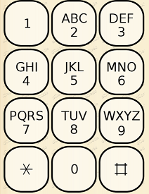

# Coding Challenge

Given a string representing key presses on a mobile phone you must complete the Decode function in the KeyPressDecoder class.

## SMS Multi Tap Code

The Multi-tap code is the name given to the mobile phone input technique that consists of writing a letter by repeating the corresponding key on the mobile phone keypad. 

For example: '2' for 'A', '22' for 'B', '222' for 'C', '3' for D, and so on 'CODE' is written '222-666-3-33'. 

If a key is pressed more times than the number it can represent then the letter cycles back to the start. 

For example '2', '2222' and '2222222' all evaluate to 'A'.

#### Special Rules for the 0 (Zero) key 
- If the message contains consectutive letters that are on the same nummeric key then the 0 key is pressed in indicate the start of a new letter. 
- If the next letter is not on the same numeric key then a 0 represents a space.
- If the next letter is the same numeric key but there is a space in between then the 0 key is pressed twice 

### Examples
- "222028" = "CAT", the 0 key represents the end of the first letter.
- "2002220208" = "A CAT", the double zero indicates the end of the first letter then a space.
- "20364" = "A DOG"

## Layout of the key pad on a Phone designed for multi-tap sms messaging
